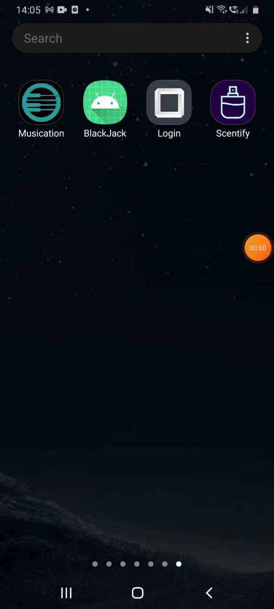
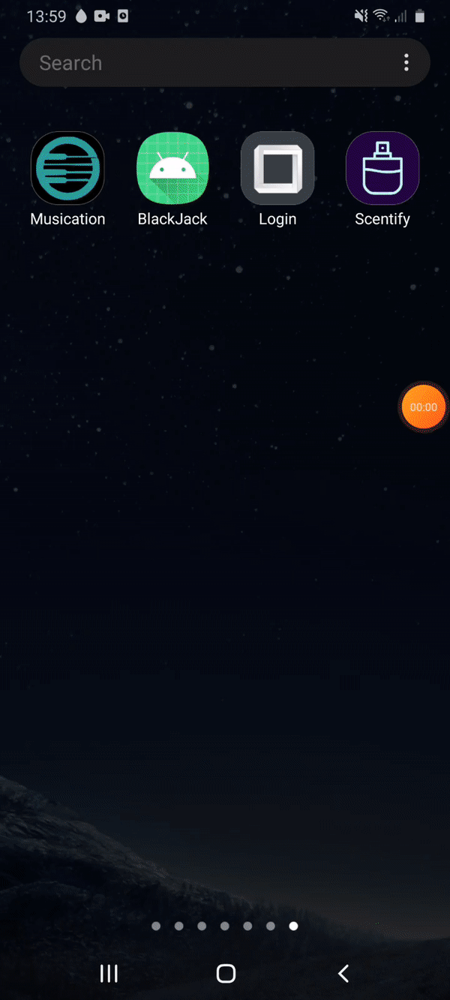
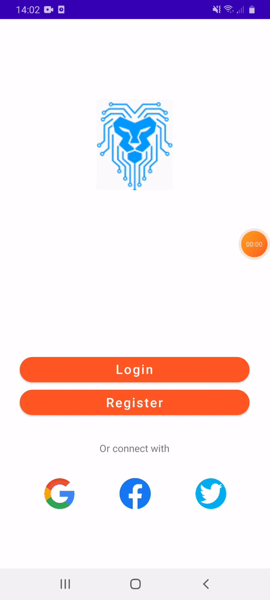

# AppProject
Created project to practice/try out a few things

Google registration/login:  

  

Attempting login without registration:  

  

Registration (including verification email)  

  

Login after registration:  

  
